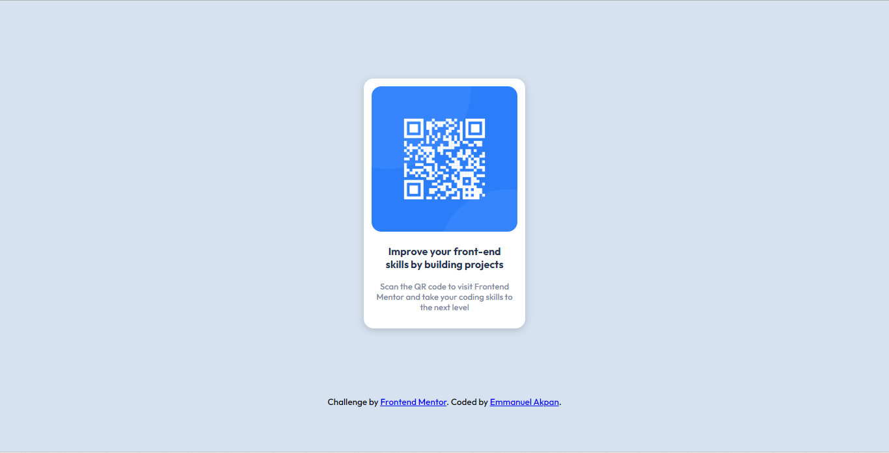

# Frontend Mentor - QR code component solution

This is a solution to the [QR code component challenge on Frontend Mentor](https://www.frontendmentor.io/challenges/qr-code-component-iux_sIO_H). Frontend Mentor challenges help you improve your coding skills by building realistic projects. 

## Table of contents

- [Frontend Mentor - QR code component solution](#frontend-mentor---qr-code-component-solution)
  - [Table of contents](#table-of-contents)
  - [Overview](#overview)
    - [Screenshot](#screenshot)
    - [Links](#links)
    - [Built with](#built-with)
    - [What I learned](#what-i-learned)
  - [Author](#author)


## Overview

### Screenshot


Desktop

### Links

- Live Site URL: [Live Site](https://emmanuelekopimo.github.io/frontendmentor/)

### Built with

- HTML5 and CSS

### What I learned

I learnt how to use fonts from the Google Fonts and how to create a mobile-first design. I also created a custom styled card component with CSS

```css
.card {
    width: 14rem;
    margin: 0px auto;
    margin-top: 7.5rem;
    margin-bottom: 6.5rem;
    padding: 12px;
    border-radius: 15px;
    box-shadow: 0px 3px 12px rgba(0, 0, 0, 0.171);
    background-color: white;
}
```

## Author

- Website - [Emmanuel Akpan](https://www.bixoftware.wordpress.com)
- Frontend Mentor - [@emmanuelekopimo](https://www.frontendmentor.io/profile/emmanuelekopimo)
- Twitter - [@emmanuelekopimo](https://www.twitter.com/emmanuelekopimo)
- GitHub - [emmanuelekopimo](https://github.com/emmanuelekopimo)